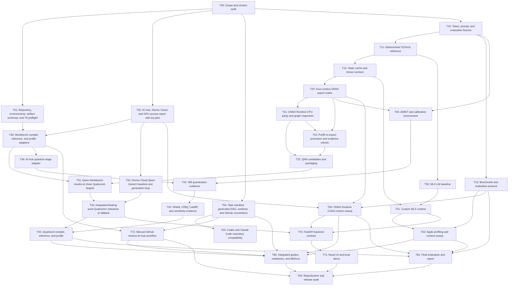
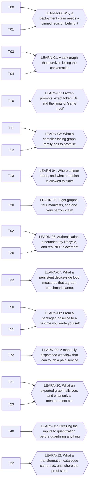

<!-- Generated by scripts/ai/render_task_status.py; do not edit. -->

# Task status

Source: `ai/tasks/task_graph.yaml`

## Dependency graph

## Status

| Task | Status | Dependencies | Resource locks | Worklog |
|---|---|---|---|---|
| T00 — Scope and version ADR | completed | — | — | ai/worklogs/2026-07-24-T00-model-version-contract.md |
| T01 — Repository, environments, artifact schemas, and T9 preflight | completed | T00 | t9_heavy_io | ai/worklogs/2026-07-24-T01-environments-manifests-storage.md |
| T02 — AI Hub, Device Cloud, and GPU access report with toy jobs | completed | T00 | qai_hub_submission, device_cloud_x_elite | ai/worklogs/2026-07-25-T02-platform-access-completion.md |
| T03 — Task manifest, generated DAG, worktree, and GitHub conventions | completed | T00 | — | ai/worklogs/2026-07-24-T03-agent-workflow-completion.md |
| T04 — Codex and Claude Code repository compatibility | completed | T03 | — | ai/worklogs/2026-07-25-T04-dual-agent-compatibility.md |
| T10 — Token, prompt, and evaluation fixtures | completed | T00 | — | ai/worklogs/2026-07-25-T10-token-prompt-evaluation-fixtures.md |
| T11 — Deterministic PyTorch reference | completed | T10 | — | ai/worklogs/2026-07-25-T11-deterministic-pytorch-reference.md |
| T12 — Static cache and tensor contract | completed | T11 | — | ai/worklogs/2026-07-27-T12-static-cache-contract.md |
| T13 — Benchmark and evaluation protocol | completed | T10 | — | ai/worklogs/2026-07-25-T13-benchmark-evaluation-protocol.md |
| T20 — Four-context ONNX export matrix | completed | T12 | t9_heavy_io | ai/worklogs/2026-07-30-T20-onnx-export-matrix.md |
| T21 — ONNX Runtime CPU parity and graph inspection | completed | T20 | — | ai/worklogs/2026-08-02-T21-ort-cpu-parity-graph-inspection.md |
| T22 — QNN candidates and packaging | completed | T21, T23 | t9_heavy_io | ai/worklogs/2026-08-03-T22-qnn-candidates-and-packaging.md |
| T23 — Prefill re-export promotion and evidence refresh | completed | T20, T21 | t9_heavy_io | ai/worklogs/2026-08-02-T23-prefill-reexport-promotion.md |
| T30 — Workbench compile, inference, and profile adapters | completed | T01, T02 | qai_hub_submission | ai/worklogs/2026-07-25-T30-ai-hub-adapters.md |
| T31 — Qwen Workbench results on three Qualcomm targets | ready | T22, T30 | qai_hub_submission | — |
| T32 — Device Cloud Qwen GenieX baseline and generation loop | completed | T02 | device_cloud_x_elite | ai/worklogs/2026-07-28-T32-device-cloud-baseline.md |
| T33 — Integrated floating-point Qualcomm milestone or fallback | blocked | T31, T32 | qai_hub_submission, device_cloud_x_elite | — |
| T34 — AI Hub quantize-stage adapter | ready | T30 | qai_hub_submission | — |
| T40 — AIMET and calibration environment | completed | T10, T20 | t9_heavy_io | ai/worklogs/2026-08-02-T40-aimet-calibration-environment.md |
| T41 — W8 quantization evidence | blocked | T40, T34 | qai_hub_submission | — |
| T42 — W4A8, LPBQ, LiteMP, and sensitivity evidence | blocked | T41 | qai_hub_submission | — |
| T43 — Quantized compile, inference, and profile | blocked | T33, T42 | qai_hub_submission, device_cloud_x_elite | — |
| T50 — MLX-LM baseline | completed | T11 | apple_m4_heavy | ai/worklogs/2026-07-27-T50-mlx-lm-baseline.md |
| T51 — Custom MLX runtime | completed | T12, T50 | apple_m4_heavy | ai/worklogs/2026-07-30-T51-custom-mlx-runtime.md |
| T52 — Apple profiling and context sweep | ready | T13, T51 | apple_m4_heavy, t9_heavy_io | — |
| T60 — ONNX Runtime CUDA context sweep | ready | T02, T13, T20 | linux_nvidia_gpu, t9_heavy_io | — |
| T70 — FastAPI backend contract | blocked | T33, T51, T60 | — | — |
| T71 — React UI and local demo | blocked | T70 | — | — |
| T72 — Manual GitHub Actions AI Hub workflow | completed | T03, T30 | — | ai/worklogs/2026-07-30-T72-qualcomm-actions.md |
| T80 — Integrated guides, notebooks, and MkDocs | blocked | T03, T43, T52, T60, T72 | — | — |
| T81 — Final evaluation and report | blocked | T13, T43, T52, T60 | t9_heavy_io | — |
| T82 — Reproduction and release audit | blocked | T71, T72, T80, T81 | — | — |

## Summary

- ready: 4
- in_progress: 0
- blocked: 9
- completed: 19

## Resource capacities

| Resource | Capacity | Spending approval |
|---|---:|---|
| apple_m4_heavy | 1 | no |
| t9_heavy_io | 1 | no |
| qai_hub_submission | 1 | no |
| device_cloud_x_elite | 1 | no |
| linux_nvidia_gpu | 1 | required only for paid fallback |

## Learning checkpoints

Study units built from completed tasks. They depend on tasks; no task depends on them, so they never gate implementation work. Source: `ai/tasks/learning_lane.yaml`.

| Checkpoint | Subject | Covers | Built | Sheet |
|---|---|---|---|---|
| LEARN-00 — The evidence contract | Why a deployment claim needs a pinned revision behind it | T00, T01 | 2026-08-03 (stale: 1) | `build/learning/learn-00.html` |
| LEARN-01 — Agentic delivery | A task graph that survives losing the conversation | T03, T04 | 2026-08-03 (stale: 1) | `build/learning/learn-01.html` |
| LEARN-02 — Fixtures as a contract | Frozen prompts, exact token IDs, and the limits of "same input" | T10 | 2026-08-03 | `build/learning/learn-02.html` |
| LEARN-03 — Static graphs and the KV-cache contract | What a compiler-facing graph family has to promise | T11, T12 | 2026-08-03 (stale: 1) | `build/learning/learn-03.html` |
| LEARN-04 — Benchmarking without false equivalence | Where a timer starts, and what a median is allowed to claim | T13 | 2026-08-03 | `build/learning/learn-04.html` |
| LEARN-05 — ONNX export as a compiler contract | Eight graphs, four manifests, and one very narrow claim | T20 | 2026-08-03 | `build/learning/learn-05.html` |
| LEARN-06 — The Qualcomm public pipeline | Authentication, a bounded toy lifecycle, and real NPU placement | T02, T30 | 2026-08-03 (stale: 1) | `build/learning/learn-06.html` |
| LEARN-07 — A real generation loop on a real device | What a persistent device-side loop measures that a graph benchmark cannot | T32 | 2026-08-03 | `build/learning/learn-07.html` |
| LEARN-08 — Apple Silicon and MLX | From a packaged baseline to a runtime you wrote yourself | T50, T51 | 2026-08-03 | `build/learning/learn-08.html` |
| LEARN-09 — CI as a deployment surface | A manually dispatched workflow that can touch a paid service | T72 | 2026-08-03 | `build/learning/learn-09.html` |
| LEARN-10 — Reading a graph before a compiler does | What an exported graph tells you, and what only a measurement can | T21, T23 | 2026-08-03 | `build/learning/learn-10.html` |
| LEARN-11 — Calibration data as a contract | Freezing the inputs to quantization before quantizing anything | T40 | 2026-08-03 | `build/learning/learn-11.html` |
| LEARN-12 — Rewriting a graph for a compiler you have not run | What a transformation catalogue can prove, and where the proof stops | T22 | 2026-08-03 | `build/learning/learn-12.html` |

Rebuild and republish these sheets:

- LEARN-00: `docs/project/plan.md` changed since 2026-08-03. Run `scripts/learning/build_learning_sheet.py LEARN-00 --record` after republishing.
- LEARN-01: `docs/project/plan.md` changed since 2026-08-03. Run `scripts/learning/build_learning_sheet.py LEARN-01 --record` after republishing.
- LEARN-03: `docs/project/plan.md` changed since 2026-08-03. Run `scripts/learning/build_learning_sheet.py LEARN-03 --record` after republishing.
- LEARN-06: `scripts/qualcomm/README.md` changed since 2026-08-03. Run `scripts/learning/build_learning_sheet.py LEARN-06 --record` after republishing.
