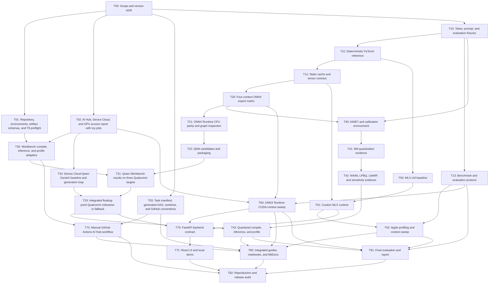

<!-- Generated by scripts/ai/render_task_status.py; do not edit. -->

# Task status

Source: `ai/tasks/task_graph.yaml`

## Dependency graph

## Status

| Task | Status | Dependencies | Resource locks | Worklog |
|---|---|---|---|---|
| T00 — Scope and version ADR | completed | — | — | ai/worklogs/2026-07-24-T00-model-version-contract.md |
| T01 — Repository, environments, artifact schemas, and T9 preflight | in_progress | T00 | t9_heavy_io | — |
| T02 — AI Hub, Device Cloud, and GPU access report with toy jobs | blocked | T00 | qai_hub_submission, device_cloud_x_elite | — |
| T03 — Task manifest, generated DAG, worktree, and GitHub conventions | completed | T00 | — | ai/worklogs/2026-07-24-T03-agent-workflow-completion.md |
| T10 — Token, prompt, and evaluation fixtures | ready | T00 | — | — |
| T11 — Deterministic PyTorch reference | blocked | T10 | — | — |
| T12 — Static cache and tensor contract | blocked | T11 | — | — |
| T13 — Benchmark and evaluation protocol | blocked | T10 | — | — |
| T20 — Four-context ONNX export matrix | blocked | T12 | t9_heavy_io | — |
| T21 — ONNX Runtime CPU parity and graph inspection | blocked | T20 | — | — |
| T22 — QNN candidates and packaging | blocked | T21 | t9_heavy_io | — |
| T30 — Workbench compile, inference, and profile adapters | blocked | T01, T02 | qai_hub_submission | — |
| T31 — Qwen Workbench results on three Qualcomm targets | blocked | T22, T30 | qai_hub_submission | — |
| T32 — Device Cloud Qwen GenieX baseline and generation loop | blocked | T02 | device_cloud_x_elite | — |
| T33 — Integrated floating-point Qualcomm milestone or fallback | blocked | T31, T32 | qai_hub_submission, device_cloud_x_elite | — |
| T40 — AIMET and calibration environment | blocked | T10, T20 | t9_heavy_io | — |
| T41 — W8 quantization evidence | blocked | T40 | qai_hub_submission | — |
| T42 — W4A8, LPBQ, LiteMP, and sensitivity evidence | blocked | T41 | qai_hub_submission | — |
| T43 — Quantized compile, inference, and profile | blocked | T33, T42 | qai_hub_submission, device_cloud_x_elite | — |
| T50 — MLX-LM baseline | blocked | T11 | apple_m4_heavy | — |
| T51 — Custom MLX runtime | blocked | T12, T50 | apple_m4_heavy | — |
| T52 — Apple profiling and context sweep | blocked | T13, T51 | apple_m4_heavy, t9_heavy_io | — |
| T60 — ONNX Runtime CUDA context sweep | blocked | T02, T13, T20 | linux_nvidia_gpu, t9_heavy_io | — |
| T70 — FastAPI backend contract | blocked | T33, T51, T60 | — | — |
| T71 — React UI and local demo | blocked | T70 | — | — |
| T72 — Manual GitHub Actions AI Hub workflow | blocked | T03, T30 | — | — |
| T80 — Integrated guides, notebooks, and MkDocs | blocked | T03, T43, T52, T60, T72 | — | — |
| T81 — Final evaluation and report | blocked | T13, T43, T52, T60 | t9_heavy_io | — |
| T82 — Reproduction and release audit | blocked | T71, T72, T80, T81 | — | — |

## Summary

- ready: 1
- in_progress: 1
- blocked: 25
- completed: 2

## Resource capacities

| Resource | Capacity | Spending approval |
|---|---:|---|
| apple_m4_heavy | 1 | no |
| t9_heavy_io | 1 | no |
| qai_hub_submission | 1 | no |
| device_cloud_x_elite | 1 | no |
| linux_nvidia_gpu | 1 | required only for paid fallback |
