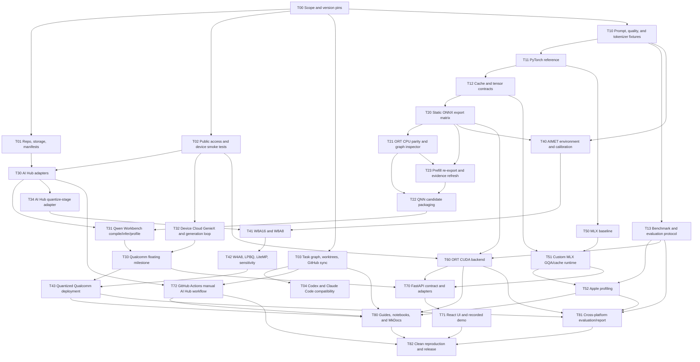

# SLM Deployment Lab: Qwen3 Deployment Engineering Across Qualcomm, Apple Silicon, and NVIDIA

Revision: 2026-07-24
Primary model: `Qwen/Qwen3-0.6B`
Core duration: six weeks at 8–12 hours per week
Target completion: before 2026-09-14
Cloud-compute ceiling: US$100, with free resources attempted first
Project character: deployment-engineering curriculum, agentic-development lab, and public portfolio

## 1. Executive decision

Build a reproducible deployment-engineering lab around Qwen3-0.6B on three platforms:

1. **Qualcomm, protected priority:** public Qualcomm AI Hub Workbench and Qualcomm Device Cloud.
2. **Apple Silicon, second priority:** a custom MLX runtime on the current M4 Mac mini.
3. **Linux/NVIDIA, third priority:** ONNX Runtime CUDA on free Colab/Kaggle capacity or an inexpensive rented GPU.

The project is not a transformer-fundamentals course. It assumes familiarity with attention, RoPE, GQA, and autoregressive language modeling. Its educational focus is the engineering that turns a model into a useful hardware deployment:

- Static prefill and decode graphs.
- Explicit KV-cache contracts and tensor layouts.
- Compiler-friendly graph packaging.
- NPU/GPU execution and profiling.
- Calibration, W8 and W4 quantization, LiteMP, LPBQ, and sensitivity analysis.
- GQA-efficient execution on Apple unified memory.
- ONNX Runtime CUDA provider placement and I/O binding.
- Reproducible multi-agent work with Codex and Claude Code, Git worktrees,
  GitHub Issues/Projects, and later GitHub Actions.

The intended public claim is:

> Built a reproducible Qwen3-0.6B deployment lab spanning Qualcomm Snapdragon/Dragonwing NPUs, Apple M4 unified-memory GPU execution, and NVIDIA CUDA; designed static prefill/decode graphs with explicit KV caches, evaluated advanced quantization, measured numerical quality and hardware behavior, and delivered the work through a dependency-aware multi-agent workflow.

## 2. Priority and scope contract

### 2.1 Protected outcome

If time becomes constrained, preserve the Qualcomm learning and implementation path first. Reduce work in this order:

1. NVIDIA optimization depth.
2. UI and presentation polish beyond the recorded demo.
3. Apple optimization variants, while retaining one correct custom MLX path.
4. Stretch goals.

Do not remove the Qualcomm full-pipeline milestone to preserve breadth.

### 2.2 Qualcomm minimum successful milestone

Using public resources only:

- Run Qualcomm’s ready-made Qwen3-0.6B/GenieX path on a Snapdragon X Elite Device Cloud machine.
- Export custom Qwen3-0.6B static prefill and decode graphs.
- Compile, run inference, and profile through AI Hub Workbench.
- Produce an end-to-end token-generation path, distinguishing hosted single-graph measurements from a persistent device-side loop.
- Compare floating-point and quantized candidates for numerical quality, latency, memory, and NPU placement.
- Target:
  - Snapdragon X Elite as the primary compile, inference, profile, and Device Cloud integration target.
  - Dragonwing IQ-9075 as an IoT/edge profile comparison.
  - Snapdragon 8 Elite as a mobile profile comparison.
- Record public toolchain boundaries and compiler failures with minimal reproductions.

Mandatory profiling evidence includes:

- Compile and runtime versions.
- Device identity.
- Graph latency.
- Load time where available.
- Peak memory where available.
- Compute-unit or NPU placement.
- Compiler/runtime warnings.
- Raw profile output and a normalized summary.

Low-level QAIRT application integration, detailed HTP op tracing, and direct QNN C/C++ execution are stretch goals.

### 2.3 Core scope

- Qwen3-0.6B only as the primary implementation model.
- Deterministic PyTorch numerical reference.
- Static prefill variants and decode/cache probes at 128, 512, 1,024, and 4,096 tokens.
- Fixed-shape, explicit KV-cache contracts.
- Reference ONNX and separate QNN-candidate graph stages.
- ONNX Runtime CPU parity.
- Qualcomm AI Hub Workbench compile, inference, and profiling.
- Qualcomm Device Cloud end-to-end deployment on Snapdragon X Elite.
- Advanced quantization study:
  - FP16 deployment baseline.
  - W8A16 and W8A8 where supported.
  - W4A8 where supported.
  - AIMET LPBQ.
  - LiteMP/mixed-precision experiments.
  - Layer or block sensitivity analysis.
- Custom MLX prefill/decode implementation on the current M4 Mac mini.
- GQA-aware KV-cache layout experiments.
- `mx.compile`, MLX profiling, Instruments traces, unified-memory analysis, and sustained power/thermal observations.
- ONNX Runtime CUDA on Linux/NVIDIA.
- Deployment-oriented numerical validation plus a small academic benchmark subset.
- OpenAI-compatible FastAPI server and lightweight React/TypeScript UI.
- Local live demo and recorded walkthrough; no continuously hosted inference endpoint.
- Concise original reading guides and hybrid Jupyter experiment notebooks.
- MkDocs site deployed free through GitHub Pages.
- Machine-readable dependency graph synchronized with GitHub Issues/Projects.
- Curated public agentic-development material.

### 2.4 Stretch scope

- Direct QAIRT SDK workflow on a supported Linux or Windows environment.
- C/C++ QAIRT integration skeleton beyond code-reading and interface design.
- Detailed HTP optrace analysis.
- QNN DLC versus linked/context-binary comparison beyond the format needed by the public path.
- Custom Metal kernels or Core ML/ANE deployment.
- TensorRT or TensorRT-LLM.
- Upstream issue or pull request.
- Speculative decoding with Qwen3-0.6B as the target model.

For speculative decoding, evaluate a smaller draft model, prompt-lookup decoding, or a self-speculative method. Measure acceptance rate, draft overhead, verification cost, and net latency; do not assume a speedup merely because fewer target steps are executed.

### 2.5 Explicit non-goals

- Training or fine-tuning Qwen3.
- Explaining transformer fundamentals already assumed by the project.
- Production multi-tenant serving.
- A paid always-on inference service.
- Claims of eNPU/LPAI execution without an exposed public target and measured evidence.
- Claims of Apple Neural Engine execution from MLX measurements.
- Treating AI Hub job turnaround as inference latency.
- Comparing complete systems as though the experiment isolated runtime software alone.
- Publishing credentials, raw private agent transcripts, private session
  identifiers, or the private plan-feedback file.

## 3. Public Qualcomm environment

### 3.1 Core public services

Use both services:

| Service | Core use |
|---|---|
| Qualcomm AI Hub Workbench | Upload, quantize, compile, infer, profile, and download deployable artifacts/results from hosted devices |
| Qualcomm Device Cloud | Interactive access to real Snapdragon hardware for installation, runtime integration, logs, and an end-to-end generation loop |

Qualcomm states that Workbench is currently free and exposes 50+ hosted devices. Device Cloud offers free minutes subject to availability and program terms. Verify access, quota, devices, versions, and job turnaround during the first project days because these are external and can change.

For future Device Cloud tasks comparable to T32, prefer reproducible CLI,
SDK, or REST workflows executed directly by Codex for session submission,
status polling, device interaction, evidence capture, and session completion.
Avoid browser-driven session lifecycle operations when a supported
command-line or API path exists. Reserve the browser for unavoidable
authentication, consent, unsupported operations, or recovery, and document
the reason whenever that fallback is required.

### 3.2 Target-device policy

| Target | Role | Required evidence |
|---|---|---|
| Snapdragon X Elite | Primary | Workbench compile/infer/profile, Device Cloud runtime, end-to-end generation |
| Dragonwing IQ-9075 | Edge/IoT comparison | Compatible compile/profile and normalized comparison |
| Snapdragon 8 Elite | Mobile comparison | Compatible compile/profile and normalized comparison |

Use an exact hosted device when possible. Clearly label family and proxy targets. Proxy metrics are not equivalent to measurements from the named physical product.

### 3.3 Qwen public-path caveat

Qualcomm currently publishes a Qwen3-0.6B Q4_0 asset for the GenieX/`llama.cpp` route. That ready-made artifact is valuable as a Device Cloud baseline, but it does not replace the custom static-graph and NPU pipeline.

The custom path should attempt:

```text
Qwen3 checkpoint
  → deterministic PyTorch wrapper
  → static prompt processor and token generator graphs
  → reference ONNX
  → QNN candidate packaging
  → Workbench quantize/compile/link as supported
  → inference jobs
  → profile jobs
  → deployable artifact
  → Device Cloud integration
```

### 3.4 Full-pipeline fallback rule

The point of the fallback is to learn the complete Qualcomm pipeline, not to avoid a hard stage.

If Qwen3 is blocked by a public compiler/runtime limitation:

1. Preserve the Qwen3 attempt and isolate the boundary with operator, transformer-block, prompt-processor, and token-generator probes.
2. Record the exact model revision, graph, command, compiler/runtime version, target, error, and smallest reproduction.
3. Dynamically choose the smallest generative model that, at implementation time, has a verified public QAIRT/NPU path on a relevant target.
4. Complete the full export → quantize → compile → inference → profile → deploy path with that model.
5. Return to Qwen3 and document which stages work and which remain blocked.

Do not preselect a fallback model now because public support changes. Qwen3 remains the only primary model and all non-Qwen work must be labeled fallback evidence.

### 3.5 eNPU/LPAI boundary

Treat eNPU and low-power AI as an architecture-reading topic relevant to the future Qualcomm role. Publicly verified execution in this project uses the named NPU/HTP path exposed by Workbench or Device Cloud.

The repo may explain:

- Main Hexagon NPU/HTP versus low-power islands and eNPU-class accelerators.
- Static memory and graph constraints that become more severe on low-power hardware.
- Why an SLM path proven on a main NPU does not establish eNPU feasibility.

Do not label an NPU result as eNPU or LPAI.

## 4. Apple Silicon target

### 4.1 Observed machine

Use the current machine as a fixed benchmark target:

| Property | Value |
|---|---|
| Product | Mac mini (2024) |
| Model identifier | `Mac16,10` |
| Model number | `MU9D3VC/A` |
| Chip | Apple M4 |
| CPU | 10 cores: 4 performance + 6 efficiency |
| GPU | 10 integrated cores |
| Neural Engine | 16 cores |
| Unified memory | 16 GB |
| Memory bandwidth | 120 GB/s |
| Architecture | `arm64` |
| Observed OS | macOS 15.7.7, build 24G720 |
| Internal SSD | 256 GB class |
| Free internal space when inspected | approximately 52 GiB; mutable |

Public results must identify this exact machine rather than saying only “Apple Silicon.”

### 4.2 Apple implementation depth

The core is runtime engineering, not only an MLX-LM command:

- Implement explicit prompt prefill and one-token decode.
- Represent KV state with stable, documented layouts.
- Avoid materializing repeated K/V heads when GQA broadcasting or grouped computation is possible.
- Compare per-layer and stacked caches where practical.
- Compare cache layouts such as head-major versus sequence-major when the MLX operators permit meaningful alternatives.
- Measure cache-update traffic and bytes per generated token.
- Make MLX lazy-evaluation boundaries explicit.
- Compare eager-style execution with `mx.compile`.
- Synchronize around timed regions.
- Keep model loading outside steady-state measurements.
- Run the 128/512/1,024/4,096 context sweep.

Profiling includes:

- TTFT components.
- Prefill tokens/second.
- Decode time/token and tokens/second.
- Kernel timing and dispatch behavior.
- Process peak memory.
- `vm_stat`, memory pressure, and swap behavior.
- Unified-memory implications.
- Instruments traces.
- MLX profiler output where supported.
- Sustained power and thermal behavior using available macOS tools, with the measurement method recorded.

Custom Metal kernels and Core ML/ANE are not core. MLX results must not imply ANE execution.

### 4.3 External SSD

The project artifact directory already exists:

```text
/Volumes/T9/slm-deployment-lab
```

Observed when created:

| Property | Value |
|---|---|
| Volume | `T9` |
| Filesystem | HFS+, local and journaled |
| Capacity | approximately 1.8 TiB |
| Free space | approximately 1.5 TiB; mutable |

Keep source code, Git metadata, environments, small raw metrics, plots, and manifests on the internal SSD. Keep model weights, caches, ONNX external data, compiled binaries, notebook caches, and large traces on T9.

Suggested external layout:

```text
/Volumes/T9/slm-deployment-lab/
├── hf-cache/
├── models/
├── onnx/
│   ├── reference/
│   ├── qnn-candidate/
│   └── quantized/
├── mlx/
├── qnn/
├── profiles/
├── notebook-cache/
└── task-artifacts/
```

Environment convention:

```bash
export SLM_LAB_ARTIFACT_ROOT=/Volumes/T9/slm-deployment-lab
export HF_HOME=/Volumes/T9/slm-deployment-lab/hf-cache
```

A preflight command must verify the mount, writable path, and free-space reserve before heavy work. Task-specific subdirectories prevent worktree collisions. Do not put credentials on the external drive.

## 5. Linux/NVIDIA target

Use an x86-64 Linux NVIDIA GPU with ONNX Runtime CUDA Execution Provider.

Access order:

1. Free Google Colab.
2. Free Kaggle notebooks.
3. Short-lived rented NVIDIA GPU.

The complete six-week cloud-compute ceiling is US$100. Free capacity is attempted first, and every paid session requires approval before launch.

Core NVIDIA engineering topics:

- CUDA/cuDNN/driver/ORT compatibility.
- Execution-provider assignment and CPU fallback detection.
- Static prefill/decode graph reuse.
- CUDA synchronization.
- I/O binding for cache tensors.
- Host/device transfer accounting.
- Warm-up and engine initialization.
- Environment capture and cost reporting.

NVIDIA begins after shared reference/export contracts are stable. It is the first platform lane reduced if Qualcomm work needs more time.

## 6. Model, graph, and numerical contracts

### 6.1 Model pinning

Pin:

- Model and tokenizer immutable revisions.
- Chat-template hash.
- Thinking-mode behavior.
- `trust_remote_code`.
- BOS/EOS/PAD IDs.
- Reference dtype.
- RoPE configuration.
- Weight tying.
- `transformers`, PyTorch, ONNX, ONNX Runtime, MLX, AIMET, and `qai-hub` versions.
- Python, CUDA, cuDNN, driver, OS, and QAIRT versions where applicable.

Use raw completion prompts or an explicitly pinned non-thinking mode for bounded deterministic validation.

### 6.2 Context matrix

Generate and test static artifacts for:

| Context | Purpose |
|---:|---|
| 128 | Earliest feasibility and short latency |
| 512 | Cache growth and common interactive prompt |
| 1,024 | Main cross-platform comparison |
| 4,096 | Long-context scaling and deployment pressure |

Start with 128 to retire compiler risk, then generate the remaining variants from the same contract. Avoid four hand-written graph implementations.

### 6.3 Reference levels

1. **Golden reference:** pinned PyTorch model in the checkpoint/reference dtype; FP32 diagnostic runs when practical.
2. **Deployment baseline:** target-compatible FP16 or BF16 floating graph.
3. **Quantized candidate:** compared with both golden and deployment references.

### 6.4 Static prefill contract

For each static prompt length `S ∈ {128, 512, 1024, 4096}` and cache capacity `C = S` or a documented larger fixed capacity:

```text
inputs
  input_ids:       integer [1, S]
  attention_mask:  target-compatible [1, S]
  position_ids:    integer [1, S]

outputs
  last_logits:     float [1, vocabulary]
  key_cache.L:     cache dtype [1, 8, C, 128], L = 0..27
  value_cache.L:   cache dtype [1, 8, C, 128], L = 0..27
  valid_length:    integer [1]
```

Per-layer tensors or a stacked cache are both acceptable, but the chosen layout must be explicit in the manifest and tests.

### 6.5 Static decode contract

```text
inputs
  input_ids:       integer [1, 1]
  attention_mask:  target-compatible [1, C]
  position_ids:    integer [1, 1]
  key_cache.L:     cache dtype [1, 8, C, 128]
  value_cache.L:   cache dtype [1, 8, C, 128]
  valid_length or cache_position

outputs
  next_logits:          float [1, vocabulary]
  present_key.L:        cache dtype [1, 8, C, 128]
  present_value.L:      cache dtype [1, 8, C, 128]
  updated_valid_length: integer [1]
```

Evaluate fixed-capacity indexed update, growing/bucketed cache, shift buffer, and runtime-managed state where public APIs expose it. The first QNN candidate should use the simplest fixed contract accepted by the compiler, but device evidence decides whether it remains.

The logical FP16 Qwen3-0.6B cache at context 1,024 is approximately 112 MiB. At 4,096 it is approximately 448 MiB. Separate input/output cache buffers can materially increase live memory and bandwidth.

### 6.6 Artifact stages

Keep distinct, immutable stages:

```text
reference_onnx
  correctness-first, readable, explicit tensors

qnn_candidate
  static target-compatible I/O, layouts, and compiler-driven rewrites

quantized_candidate
  exact encodings/QDQ/precision recorded

deployed_artifact
  target/runtime/version-specific output
```

Each rewrite requires:

```text
observed issue
→ exact transformation
→ numerical result
→ ORT result
→ compiler result
→ device profile result
```

Node-count reduction is not evidence of an optimization.

### 6.7 Numerical validation

Record:

- Maximum and mean absolute logit error.
- Protected relative error.
- Cosine similarity.
- KL divergence or documented top-k approximation.
- Top-1 agreement and top-5 overlap.
- Reference top-1/top-2 margin.
- Per-layer cache error.
- Cached versus full-forward error by decode step.
- Exact token agreement for deterministic canary prompts.

Use distinct tolerances for dtype conversion, ONNX export, backend parity, and quantized quality. Token equality is a canary, not the only criterion.

### 6.8 Quality evaluation

Use a deployment-oriented suite plus a small `lm-evaluation-harness` subset:

- Pinned prompt and token fixtures.
- WikiText-2 perplexity or negative log-likelihood with exact revision/window policy.
- Pilot `hellaswag`, `arc_easy`, and `piqa`.
- Freeze only the two or three tasks that run reliably and provide non-degenerate scores for the pinned 0.6B model.

The benchmark subset detects optimization regressions; it is not intended to establish broad model capability.

## 7. Quantization plan

### 7.1 Two complementary lanes

**Lane A — AI Hub Workbench**

- Query current supported quantization modes instead of relying on stale flags.
- Establish W8A16 and W8A8 baselines where supported.
- Attempt W4A8 and LiteMP through the public APIs where supported.
- Save service versions, options, encodings, compiler logs, and profile evidence.

**Lane B — local AIMET**

- Reproduce W8A16/W8A8 simulation where possible.
- Apply LPBQ with documented compressed/decompressed precision.
- Export ONNX/external data/encodings in the current Workbench package format.
- Run layer/block sensitivity analysis.
- Use sensitivity results to form a small mixed-precision candidate set.

### 7.2 Experiment matrix

| ID | Purpose | Weights | Activations | Cache | Required outcome |
|---|---|---:|---:|---:|---|
| D0 | Floating baseline | FP16/BF16 | FP16/BF16 | FP16/BF16 | Compile, infer, profile |
| Q1 | Conservative PTQ | INT8 | INT16 | FP16/INT16 | Quality and deployment evidence |
| Q2 | Aggressive PTQ | INT8 | INT8 | INT8 or supported type | Quality and deployment evidence |
| Q3 | Low-bit target | INT4 | INT8 | supported type | W4A8 attempt and evidence |
| Q4 | AIMET LPBQ | W4 with documented D-grid | documented | documented | Simulation, export, package, compile attempt |
| Q5 | LiteMP/mixed precision | sensitivity-selected | mixed | documented | Profiled candidate or bounded blocker |

Do not report a simulated precision as deployed without artifact and compiler evidence.

### 7.3 Quantization measurements

- Calibration corpus revision and token budget.
- Quantization and calibration time.
- Layer inclusion/exclusion report.
- Encoding format and hashes.
- Perplexity and small benchmark change.
- Logit/cache error.
- Artifact size.
- Peak memory.
- Graph latency and NPU placement.
- End-to-end generation impact where a persistent loop exists.

Advanced quantization is core. If a Qwen candidate cannot traverse the public pipeline, use the full-pipeline fallback while retaining the Qwen sensitivity and failure analysis.

## 8. Educational design

### 8.1 Principle

Learning artifacts support the implementation without imposing mandatory
learner checkpoints. Codex and Claude Code agents may implement, test,
benchmark, document, and commit autonomously in their assigned worktrees. The
user decides when to inspect, intervene, reproduce, or go deeper.

Avoid requirements such as:

- “The learner writes the initial hypothesis.”
- “The learner explains the diff back.”
- “The learner must approve every phase.”

Instead, keep decisions, evidence, runnable experiments, and concise explanations available whenever the user wants to inspect them.

### 8.2 Reading-guide standard

Each major phase has a concise original guide under `docs/learning/`. A guide should include:

- The deployment problem and why it matters on the target hardware.
- A system diagram or tensor/data-flow view when useful.
- Important APIs, constraints, formats, and failure modes.
- Performance model: compute, memory traffic, synchronization, and state.
- How the repository implements the concept.
- Primary-source reading list.
- Commands and links to the related notebook, code, tests, and results.

Do not repeat basic explanations of attention. Discuss GQA only where it changes cache size, data layout, kernel behavior, or target efficiency.

### 8.3 Notebook standard

Notebooks use a hybrid style:

- Concise engineering context.
- Runnable baseline.
- Editable parameters.
- Correctness assertions.
- Plots or tables.
- Interpretation guidance.
- Direct links to production code and manifests.
- Clear hardware/environment tags.
- Restart-and-run-all behavior.

Suggested tags:

```text
smoke
requires_model
requires_mlx
requires_cuda
requires_aimet
requires_qai_hub
external_job
may_cost_money
```

External-job cells default to dry-run or explicit opt-in.

### 8.4 Educational map

| Module | Original guide | Notebook/lab | Engineering emphasis |
|---|---|---|---|
| E00 | `model_deployment_budget.md` | `00_model_shape_memory_budget.ipynb` | Qwen tensor shapes, KV/cache bytes, bandwidth and artifact budgets |
| E01 | `static_autoregressive_graphs.md` | `01_prefill_decode_cache_contracts.ipynb` | Static prompt processor/token generator contracts and cache update costs |
| E02 | `onnx_for_hardware_compilers.md` | `02_onnx_export_and_shapes.ipynb`, `03_graph_inspection.ipynb` | Export constraints, external data, graph inspection, compiler-driven rewrites |
| E03 | `qualcomm_public_pipeline.md` | `04_ai_hub_pipeline.ipynb` | Workbench upload/quantize/compile/infer/profile and Device Cloud deployment |
| E04 | `qualcomm_profiling.md` | `05_qnn_profile_analysis.ipynb` | NPU placement, graph latency, load/memory, profile interpretation |
| E05 | `quantization_for_qualcomm.md` | `06_w8_w4_calibration.ipynb`, `07_litemp_lpbq_sensitivity.ipynb` | W8/W4, calibration, AIMET, LiteMP, LPBQ, sensitivity |
| E06 | `apple_m4_mlx_runtime.md` | `08_mlx_gqa_kv_layout.ipynb`, `09_mlx_compile_and_profile.ipynb` | GQA-efficient layout, lazy evaluation, `mx.compile`, unified memory |
| E07 | `onnxruntime_cuda.md` | `10_ort_cuda_iobinding.ipynb` | Provider placement, synchronization, I/O binding |
| E08 | `deployment_benchmarking.md` | `11_cross_platform_benchmark.ipynb`, `12_quantization_quality.ipynb` | Fair system comparisons, statistics, quality/performance tradeoffs |
| E09 | `agentic_delivery.md` | Markdown lab | DAGs, task boundaries, worktrees, handoffs, review, resumable coordination |
| E10 | `github_actions_for_ai_hub.md` | Markdown workflow lab | CI concepts, secrets, manual dispatch, artifacts, AI Hub API orchestration |

Jupyter is appropriate for numerical and runtime experiments. Git, agent-tool,
and GitHub Actions operations use Markdown labs and real repository workflows.

## 9. Phase plan

Phases describe dependency gates, not a requirement that all work happen sequentially.

### Phase 0 — Public access, environment, and risk spike

Reading:

- `docs/learning/qualcomm_public_pipeline.md`
- `docs/learning/model_deployment_budget.md`
- `docs/agentic/agentic_delivery.md`

Experiments:

- `00_model_shape_memory_budget.ipynb`
- `04_ai_hub_pipeline.ipynb` in dry-run/toy mode

Tasks:

- Pin model/tokenizer and environment versions.
- Capture the M4 host manifest.
- Configure T9 paths and mount/free-space preflight.
- Create task manifest schema, generated DAG, GitHub issue templates, and worktree conventions.
- Verify Qualcomm ID, AI Hub API token, available devices, quotas, and current QAIRT/runtime versions.
- Request/use Device Cloud free minutes for Snapdragon X Elite.
- Run a tiny Workbench compile → inference → profile job.
- Verify Colab/Kaggle availability and define the paid-rental command without launching it.
- Run the public GenieX Qwen asset as early as Device Cloud access permits.

Gate:

- Workbench compile/infer/profile lifecycle is proven with a toy model.
- Device Cloud access is confirmed or a documented access request is pending.
- External storage and manifests work.
- Public target names and versions are recorded.

### Phase 1 — Reference, graph contracts, and early Qwen compile attempt

Reading:

- `docs/learning/static_autoregressive_graphs.md`
- `docs/learning/onnx_for_hardware_compilers.md`

Notebooks:

- `01_prefill_decode_cache_contracts.ipynb`
- `02_onnx_export_and_shapes.ipynb`
- `03_graph_inspection.ipynb`

Tasks:

- Implement deterministic PyTorch full-forward and cached decoding.
- Freeze tokenizer fixtures, quality data, and numerical thresholds.
- Generate static contracts for 128/512/1,024/4,096.
- Export a 128-token Qwen prefill/decode pair first.
- Run multi-step ONNX Runtime CPU parity.
- Package external weights correctly.
- Submit the first full Qwen compile attempt immediately.
- Build minimal graph inspection needed to diagnose the result.

Gate:

```text
Qwen3 deterministic reference
+ fixed cache contract
+ 128-token reference ONNX
+ multi-step ORT execution
+ Workbench compile result
+ bounded reproduction if blocked
```

Do not defer Qualcomm feasibility until after broad local implementation.

### Phase 2 — Qualcomm floating deployment

Reading:

- `docs/learning/qualcomm_public_pipeline.md`
- `docs/learning/qualcomm_profiling.md`

Notebooks:

- `04_ai_hub_pipeline.ipynb`
- `05_qnn_profile_analysis.ipynb`

Tasks:

- Build compiler, inference, profile, artifact-download, and result-normalization adapters.
- Produce QNN candidates from the frozen graph contract.
- Generate the complete 128/512/1,024/4,096 context matrix.
- Compile, infer, and profile the primary X Elite path.
- Profile compatible variants on IQ-9075 and Snapdragon 8 Elite.
- Run GenieX Qwen on Device Cloud X Elite.
- Build an end-to-end generation loop on Device Cloud.
- Separate single-graph Workbench profiles from end-to-end generation timings.
- Trigger the dynamic full-pipeline fallback if Qwen blocks.

Gate:

- The Qualcomm minimum successful milestone is met for the floating path.
- All three named targets have honest compatible evidence or explicit availability/compatibility blockers.
- Raw profiles, output comparisons, manifests, and failure reports are committed or referenced by checksum.

### Phase 3 — Advanced Qualcomm quantization

Reading:

- `docs/learning/quantization_for_qualcomm.md`
- current AIMET and Workbench quantization documentation

Notebooks:

- `06_w8_w4_calibration.ipynb`
- `07_litemp_lpbq_sensitivity.ipynb`

Tasks:

- Freeze the calibration corpus.
- Run Workbench W8A16/W8A8 baselines.
- Build AIMET W8 parity and LPBQ candidates.
- Attempt W4A8 through the current supported public route.
- Produce a layer/block sensitivity map.
- Form a bounded LiteMP/mixed-precision candidate set.
- Compile, infer, and profile deployable quantized candidates.
- Compare quality, memory, placement, and latency with D0.

Gate:

- D0, W8, and at least one W4/mixed candidate have complete quality evidence.
- At least one W8 and one low-bit/mixed candidate traverse the full pipeline, using the dynamic fallback if Qwen support blocks completion.
- No unsupported precision is presented as deployed.

### Phase 4 — Apple M4 runtime engineering

This phase begins in parallel after the Phase 1 model/cache contracts are stable. Qualcomm receives more agent time and exclusive priority when shared artifacts or user attention conflict.

Reading:

- `docs/learning/apple_m4_mlx_runtime.md`

Notebooks:

- `08_mlx_gqa_kv_layout.ipynb`
- `09_mlx_compile_and_profile.ipynb`

Tasks:

- Establish MLX-LM output parity as a baseline.
- Implement custom prefill/decode and explicit cache state.
- Test GQA-aware cache layouts without unnecessary K/V replication.
- Add `mx.compile` variants.
- Run all four contexts.
- Measure TTFT, prefill, decode, memory, dispatch/kernel behavior, power, and thermal drift.
- Capture Instruments/MLX traces and sanitized summaries.
- Add FP16 and a clearly separate MLX 4-bit comparison.

Gate:

- Custom MLX generation passes canary and quality checks.
- Profiles explain observed bottlenecks in terms of layout, materialization, dispatch, or memory traffic.
- Results identify the exact M4 machine and make no ANE claim.

### Phase 5 — NVIDIA, common API, and local demo

Reading:

- `docs/learning/onnxruntime_cuda.md`

Notebook:

- `10_ort_cuda_iobinding.ipynb`

Tasks:

- Build the Linux/CUDA environment.
- Run all context variants with ORT CUDA.
- Fail explicitly on unexpected CPU provider fallback.
- Compare ordinary feeds with I/O binding.
- Implement a backend-neutral OpenAI-compatible FastAPI interface.
- Implement a lightweight React/TypeScript UI.
- Support backend selection and display manifest/result metadata.
- Record a local live walkthrough.

Gate:

- ORT CUDA runs the shared workloads with provider evidence.
- FastAPI passes conformance tests.
- React UI works against at least the Apple local backend and a replay/mock result adapter; Qualcomm live mode runs in its Device Cloud environment.
- No paid hosted inference is required.

### Phase 6 — Evaluation, GitHub Actions, documentation, and release

Reading:

- `docs/learning/deployment_benchmarking.md`
- `docs/learning/github_actions_for_ai_hub.md`

Notebooks:

- `11_cross_platform_benchmark.ipynb`
- `12_quantization_quality.ipynb`

Tasks:

- Freeze benchmark repetitions, warm-up, synchronization, context matrix, and result schema.
- Run numerical, quality, and performance suites.
- Normalize raw results without erasing system differences.
- Add portable CI tests and notebook smoke tests.
- After the local AI Hub scripts are stable, add a manually dispatched GitHub Actions workflow.
- Build MkDocs and publish through GitHub Pages.
- Finish README, architecture, limitations, selected failure analyses, and curated agentic case studies.
- Record the demo and prepare evidence-based resume bullets.

Gate:

- Results regenerate from committed small data and manifests.
- The manual GitHub Actions workflow is explained and tested without exposing a token.
- The documentation site builds from a clean checkout.
- Public claims trace to evidence.

## 10. Task dependency graph

### 10.1 Status semantics

- `planned`: stored manifest state for work that has not started.
- `ready`: generated display state for a planned task whose dependencies are
  integrated.
- `blocked`: generated when a planned task has incomplete dependencies, or
  stored explicitly when an external blocker remains after dependencies are
  complete.
- `in_progress`: stored state for work assigned to an owner and branch after
  its dependencies are integrated.
- `completed`: stored state only after dependencies, outputs, acceptance
  checks, public worklog, and integration are complete.

Logical readiness and hardware availability are different. A task may be ready but waiting for the M4, AI Hub quota, Device Cloud session, or NVIDIA GPU.

### 10.2 Core DAG



### 10.3 Work packages and parallelism

| ID | Main output | Dependencies | Useful parallel work |
|---|---|---|---|
| T00 | Scope/version ADR | None | T02 discovery |
| T01 | Repo, environment, artifact schemas, T9 preflight | T00 | T02, T03, T10 |
| T02 | AI Hub/QDC/GPU access report and toy jobs | T00 | T01, T03, T10 |
| T03 | Task manifest, generated DAG, worktree and GitHub sync conventions | T00 | T01, T02, T10 |
| T04 | Codex and Claude Code repository compatibility | T03 | All non-overlapping tasks |
| T10 | Token/prompt/evaluation fixtures | T00 | T01–T03 |
| T11 | Deterministic PyTorch reference | T10 | T13, T30 |
| T12 | Static cache/tensor contract | T11 | T13, T30, T50 |
| T13 | Benchmark/evaluation protocol | T10 | T11, T12 |
| T20 | Four-context ONNX export matrix | T12 | T30, T50 |
| T21 | ORT CPU parity and graph inspection | T20 | T30, T50 |
| T22 | QNN candidates and packaging | T21, T23 | T32, T40, T51 |
| T23 | Promoted prefill export and refreshed evidence | T20, T21 | T41, T52 |
| T30 | Workbench compile/infer/profile adapters | T01, T02 | T11–T22 |
| T31 | Qwen Workbench results on three targets | T22, T30 | T32, T40, T51 |
| T32 | Device Cloud Qwen/GenieX and generation loop | T02 | T20–T31 |
| T33 | Integrated floating Qualcomm milestone or fallback | T31, T32 | T41, T51 |
| T34 | AI Hub quantize-stage adapter | T30 | T41 |
| T40 | AIMET/calibration environment | T10, T20 | T31, T50, T51 |
| T41 | W8 quantization evidence | T40, T34 | T33, T51, T60 |
| T42 | W4/LiteMP/LPBQ/sensitivity evidence | T41 | T52, T60 |
| T43 | Quantized compile/infer/profile | T33, T42 | T52, T60 |
| T50 | MLX-LM baseline | T11 | T20–T40 |
| T51 | Custom MLX runtime | T12, T50 | T31–T43 |
| T52 | Apple profile/context sweep | T51, T13 | T42, T60 |
| T60 | ORT CUDA context sweep | T02, T20, T13 | T42, T52 |
| T70 | FastAPI backend contract | T33, T51, T60 | T80 |
| T71 | React UI and local demo | T70 | T72, T80, T81 |
| T72 | Manual GitHub Actions AI Hub workflow | T03, T30 | T71, T80, T81 |
| T80 | Integrated guides, notebooks, MkDocs | T03, T43, T52, T60, T72 | Most code tasks with separate file ownership |
| T81 | Final evaluation and report | T13, T43, T52, T60 | T71, T72, T80 |
| T82 | Reproduction/release audit | T71, T72, T80, T81 | None on release files |

### 10.4 Resource locks

```yaml
resources:
  apple_m4_heavy:
    capacity: 1
    purpose: model loading, export, MLX profiling, or local benchmark
  t9_heavy_io:
    capacity: 1
    root: /Volumes/T9/slm-deployment-lab
  qai_hub_submission:
    capacity: 1
  device_cloud_x_elite:
    capacity: 1
  linux_nvidia_gpu:
    capacity: 1
    paid_fallback_requires_approval: true
```

Code and documentation can progress concurrently while heavy hardware work is serialized.

## 11. Multi-agent and Git operating model

### 11.1 Autonomy

Within an assigned task/worktree, Codex and Claude Code agents may:

- Read relevant repository and primary documentation.
- Implement and refactor in scope.
- Add tests, notebooks, guides, and benchmark code.
- Run local verification and approved external jobs.
- Commit coherent task-scoped changes.
- Produce integration handoffs.

Ask before:

- Accessing or changing secrets.
- Spending money.
- Destructive actions.
- Publishing, pushing, opening public PRs/issues, or changing other external state.

No plan step requires the user to write a hypothesis, explain a diff, or approve every phase. The user may intervene whenever useful.

### 11.2 Flexible thread topology

Use a hybrid:

- Long-lived Qualcomm, Apple, NVIDIA, education, and integration tasks when continuity helps.
- Isolated worktrees/branches for parallel, high-conflict, or independently reviewable work packages.
- Bounded subagents for research, log analysis, or read-only review when a separate branch is unnecessary.

The coordinating agent session is replaceable. A new Codex or Claude Code
session must be able to resume from repository state rather than private
conversation history.

Required resumability files:

- `ai/tasks/task_graph.yaml`
- `ai/tasks/status.generated.md`
- `ai/handoffs/coordinator.md`
- `docs/decisions/`
- merged manifests and test evidence

Do not make a private session ID part of a public dependency.

### 11.3 Branch/worktree convention

```text
task/T31-qwen-workbench
task/T42-low-bit-quantization
task/T51-mlx-runtime
task/T60-ort-cuda
```

Rules:

- Start from the integration commit containing all dependencies.
- Create the task branch and worktree explicitly with Git from the committed
  public ownership claim. Historical `codex/TNN-*` branches remain valid.
- One active writer per file set.
- Prefer a task-scoped commit history.
- Integrate in topological order.
- Downstream tasks consume merged contracts, not another worktree’s uncommitted files.
- A contract change is recorded as an ADR and propagated through the task graph.
- A platform task may own multiple adjacent work packages when that reduces handoff cost.

### 11.4 Machine-readable tasks and GitHub synchronization

`ai/tasks/task_graph.yaml` is the repository source of truth. It includes:

```yaml
T31:
  title: Qwen Workbench results on three Qualcomm targets
  definition: ai/tasks/definitions/T31.yaml
  status: planned
  depends_on: [T22, T30]
  owner: null
  branch: null
  github_issue: null
  resource_locks: [qai_hub_submission]
  worklog: null
```

The referenced task definition contains:

```yaml
id: T31
objective: Compile, infer, and profile Qwen on the three Qualcomm targets.
owned_paths:
  - results/raw/qualcomm/workbench/
outputs:
  - X Elite compile/inference/profile evidence
  - compatible IQ-9075 and 8 Elite evidence or exact blockers
acceptance:
  - device and toolchain versions are captured
  - inference is compared numerically
  - profile metadata is normalized
```

Generate:

- Mermaid dependency graph.
- Ready/blocked/status tables.
- Resource queue.
- GitHub Issue bodies and dependency links.

GitHub Issues/Projects mirror the manifest. Synchronization must detect drift and never silently overwrite a newer manual change. Creating or modifying public GitHub state requires approval.

### 11.5 Public agentic artifacts

Publish curated, reusable material:

- This overall project plan.
- `AGENTS.md` and `PLANS.md`.
- Task prompt and review templates.
- Machine-readable DAG and generated status.
- Worktree/handoff conventions.
- Selected case studies showing task decomposition, a failure, verification, and integration.
- GitHub Actions workflow and its guide.

Do not publish:

- Private planning inputs or feedback.
- Raw agent transcripts.
- Private agent session IDs.
- Local registries.
- Credentials, private paths beyond documented project paths, or unsanitized cloud logs.

The plan remains mostly stable. Day-to-day completion status belongs in task manifests and GitHub Issues/Projects. Edit the plan when scope, architecture, priority, or risk policy changes.

## 12. Six-week schedule

The schedule assumes 48–72 focused hours. It intentionally leaves roughly a one-week calendar buffer before September 14.

### Week 1 — Access and vertical slice

Primary:

- T00–T03.
- T10–T12.
- Workbench toy compile/infer/profile.
- Device Cloud access/minutes.
- Qwen 128-token export and first Workbench compile attempt.

Parallel:

- MLX-LM baseline.
- Reading guides/notebook scaffolds tied to active work.

Exit:

- Public Qualcomm access is real, not assumed.
- Qwen reference/cache contracts exist.
- First compiler result exists.

### Week 2 — Qualcomm floating path and Apple runtime start

Primary:

- T20–T22 and T30–T32.
- Generate context variants.
- Begin X Elite Workbench and Device Cloud paths.

Parallel:

- T50–T51.
- Benchmark/evaluation protocol.

Exit:

- X Elite compile/infer/profile evidence or bounded Qwen blocker.
- GenieX baseline runs on Device Cloud.
- Custom MLX cache design is executable.

### Week 3 — Qualcomm three-target milestone

Primary:

- T31–T33.
- X Elite full path.
- IQ-9075 and Snapdragon 8 Elite comparison profiles.
- Dynamic fallback if needed to complete the pipeline.

Parallel:

- Custom MLX context sweep.
- AIMET environment/calibration.

Exit:

- Floating Qualcomm minimum milestone is complete.
- Apple implementation is ready for deep profiling.

### Week 4 — Advanced quantization and Apple profiling

Primary:

- T40–T43.
- W8, W4, LiteMP/LPBQ, sensitivity, compile/infer/profile.

Parallel:

- T52 Apple profiling and thermal/power runs.
- ORT CUDA environment smoke test.

Exit:

- Advanced quantization evidence is complete or bounded by exact public-tool limitations.
- Apple M4 report explains GQA/cache/layout behavior with profiles.

### Week 5 — NVIDIA, API/UI, and frozen evaluation

Primary:

- T60.
- T70–T71.
- T81 benchmark runs begin.

Parallel:

- Repeat noisy Qualcomm/Apple measurements.
- Draft final educational integration and docs.

Exit:

- All three platforms have comparable manifest-backed results.
- Local API/UI demo works.

### Week 6 — Automation and portfolio release

Primary:

- T72, T80–T82.
- Add manual GitHub Actions only after local AI Hub scripts are stable.
- Build/publish MkDocs.
- Run clean reproduction and secret/license audit.
- Record walkthrough and finalize README/results.

Exit:

- Public repo is navigable in five minutes.
- Full learning path is available without requiring raw agent transcripts.
- Resume claims match measured results.

## 13. GitHub Actions learning and automation

GitHub Actions is introduced just in time, not assumed knowledge.

### 13.1 Portable CI

On pull requests:

- Lint/type/unit tests.
- Synthetic graph-contract tests.
- Manifest/schema validation.
- Notebook smoke cells that require no model, secret, special hardware, or paid service.
- MkDocs build.
- React/FastAPI tests.

### 13.2 Manual Qualcomm workflow

After local scripts are stable, add:

```text
.github/workflows/qualcomm-benchmark.yml
```

Use `workflow_dispatch` inputs such as:

- Target device.
- Context length.
- Precision/artifact manifest.
- Compile/inference/profile stages.

Flow:

```text
manual Run workflow
  → GitHub-hosted Linux runner
  → install pinned client
  → read encrypted QAI_HUB_API_TOKEN
  → submit Workbench jobs
  → poll and download sanitized results/logs
  → validate manifests
  → upload GitHub workflow artifacts
```

The GitHub runner is an orchestrator; Qualcomm hardware executes the model.
Device Cloud interactive-session lifecycle operations should use the
Codex-operated CLI, SDK, or REST path described in Section 3.1 rather than a
browser whenever supported.

Do not:

- Schedule recurring Qualcomm jobs in the six-week core.
- Print tokens or private configuration.
- expose secrets to untrusted fork workflows.
- Upload large model weights as ordinary workflow artifacts.

The guide `docs/learning/github_actions_for_ai_hub.md` explains runners, workflows, triggers, jobs, steps, secrets, artifacts, manual dispatch, and the repository’s exact workflow.

## 14. Benchmark protocol

### 14.1 Required workloads

| Workload | Prompt/cache tokens | Generated tokens | Purpose |
|---|---:|---:|---|
| S128 | 128 | 32 | Short/static feasibility |
| S512 | 512 | 64 | Interactive/cache growth |
| S1024 | 1,024 | 128 | Main cross-platform comparison |
| S4096 | 4,096 | 128 | Long-context scaling |
| Decode probes | preloaded 128/512/1,024/4,096 | 1 repeated | Time/token versus cache length |

### 14.2 Measurement definitions

Freeze before final runs:

- Exact token IDs and prompt corpus revision.
- Batch size.
- Warm-up count and measured repetitions.
- Synchronization around GPU work.
- Median, p90/p95, dispersion, and sample count.
- Model load/compile inclusion or exclusion.
- TTFT components.
- Prefill throughput.
- Decode latency/time per output token.
- Sustained generation including and excluding prefill.
- Peak-memory mechanism.
- Power/thermal method where measured.
- Device/OS/runtime/compiler/driver versions.
- Artifact/source commit hashes.

### 14.3 Interpretation

- AI Hub single-graph latency is not end-to-end generation throughput.
- Device Cloud end-to-end timing includes the runtime loop and should separately report tokenization and loading.
- Apple, NVIDIA, and Qualcomm numbers are system results.
- Cold artifact/model load is reported separately from warm inference.
- Context-length scaling is more informative than one headline token/s value.

## 15. API and demo architecture

### 15.1 Local backends

```text
PyTorchBackend
OnnxRuntimeCpuBackend
OnnxRuntimeCudaBackend
MlxBackend
GenieXBackend (inside supported Qualcomm environment)
```

Each backend reports capabilities, contexts, dtypes, device/runtime identity, and measurement hooks.

### 15.2 Remote adapters

```text
QaiHubCompiler
QaiHubInferenceRunner
QaiHubProfileRunner
```

Do not pretend a remote hosted job is a local token-by-token backend.

### 15.3 Demo

- FastAPI exposes an OpenAI-compatible chat/completions surface plus backend metadata.
- React/TypeScript provides a small chat UI, backend selector, and benchmark/manifest panel.
- The live demo runs locally or inside the relevant Device Cloud session.
- GitHub visitors receive screenshots and a short recorded walkthrough.
- No always-on public inference endpoint is required.

## 16. Repository layout

```text
slm-deployment-lab/
├── README.md
├── LICENSE
├── AGENTS.md
├── CLAUDE.md
├── PLANS.md
├── mkdocs.yml
├── pyproject.toml
├── .gitignore
├── .github/
│   ├── ISSUE_TEMPLATE/
│   └── workflows/
│       ├── ci.yml
│       ├── docs.yml
│       └── qualcomm-benchmark.yml
├── .githooks/
│   ├── pre-commit
│   └── post-checkout
├── ai/
│   ├── README.md
│   ├── plans/
│   │   ├── active/
│   │   ├── completed/
│   │   └── templates/
│   ├── tasks/
│   │   ├── task_graph.yaml
│   │   ├── definitions/
│   │   ├── status.generated.md
│   │   └── thread_registry.example.yaml
│   ├── prompts/
│   ├── handoffs/
│   └── worklogs/
├── .ai-local/                 # Entire tree is ignored
│   ├── inputs/
│   ├── plans/
│   ├── tasks/
│   ├── handoffs/
│   ├── worklogs/
│   ├── profiles/
│   └── scratch/
├── configs/
│   ├── models/
│   ├── environments/
│   ├── targets/
│   ├── workloads/
│   ├── quantization/
│   └── storage/
├── docs/
│   ├── index.md
│   ├── project/
│   │   └── plan.md
│   ├── architecture/
│   ├── decisions/
│   ├── failures/
│   ├── learning/
│   ├── results/
│   └── agentic/
│       └── case-studies/
├── notebooks/
│   ├── 00_model_shape_memory_budget.ipynb
│   ├── 01_prefill_decode_cache_contracts.ipynb
│   ├── 02_onnx_export_and_shapes.ipynb
│   ├── 03_graph_inspection.ipynb
│   ├── 04_ai_hub_pipeline.ipynb
│   ├── 05_qnn_profile_analysis.ipynb
│   ├── 06_w8_w4_calibration.ipynb
│   ├── 07_litemp_lpbq_sensitivity.ipynb
│   ├── 08_mlx_gqa_kv_layout.ipynb
│   ├── 09_mlx_compile_and_profile.ipynb
│   ├── 10_ort_cuda_iobinding.ipynb
│   ├── 11_cross_platform_benchmark.ipynb
│   └── 12_quantization_quality.ipynb
├── src/
│   └── slm_lab/
│       ├── models/
│       ├── contracts/
│       ├── export/
│       ├── graph/
│       ├── generation/
│       ├── backends/
│       ├── deployment/
│       ├── quantization/
│       ├── benchmark/
│       ├── evaluation/
│       └── manifests/
├── apps/
│   ├── api/
│   └── web/
├── tests/
├── scripts/
│   ├── ai/
│   ├── repo/
│   └── setup/
├── environments/
│   ├── macos-m4/
│   ├── linux-cuda/
│   └── linux-aimet/
└── results/
    ├── raw/
    ├── processed/
    ├── plots/
    ├── manifests/
    ├── hosts/
    └── costs.csv
```

The ignored `artifacts/` entry may be a local symlink to
`/Volumes/T9/slm-deployment-lab`. Manifests reference external artifacts by
checksum so the committed repository remains portable.

T01 adds and commits `uv.lock` after dependency versions and environment
boundaries are selected; the scaffold does not invent a lockfile before that
work is complete.

## 17. Artifact and publication policy

### 17.1 Commit

- Small raw metrics.
- Normalized results.
- Plots.
- Environment and target manifests.
- Checksums and reproducible commands.
- Sanitized compiler/profile excerpts.
- Selected small fixtures.

### 17.2 Keep on T9

- Model weights.
- ONNX external data.
- Compiled binaries.
- Full traces.
- Large notebook caches.
- Downloaded SDK/tool archives.

### 17.3 Keep private/local

- Everything under `.ai-local/inputs/`.
- `.env` and tokens.
- Raw agent transcripts.
- Real agent session registry.
- Unsanitized Device Cloud or Workbench account information.

### 17.4 Artifact manifest

```yaml
schema_version:
model_id:
model_revision:
tokenizer_revision:
chat_template_sha256:
source_artifact_sha256:
git_commit:
task_id:
exporter:
exporter_version:
opset:
input_contract:
cache_contract:
context_length:
precision:
quantization:
calibration_dataset_revision:
runtime:
runtime_version:
qairt_version:
target_device:
device_type:
compile_options:
profile_options:
provider_options:
host_manifest_sha256:
created_at:
```

## 18. Risk register

| Risk | Likelihood | Impact | Mitigation/decision |
|---|---|---|---|
| Qwen export emits unsupported/dynamic operations | Medium | High | Attempt full graph in Week 1; isolate minimal graphs; retain failure analysis |
| Qwen cannot complete the public NPU pipeline | Medium | High | Dynamic smallest verified generative fallback completes the full Qualcomm path |
| Fixed-cache update causes copies or unsupported scatter | High | High | Compare cache strategies; measure bytes and profiles before freezing candidate |
| 4,096 context causes artifact, memory, or compile pressure | Medium | High | Generate from shared contract; test early after 128; report exact boundary |
| AI Hub/QDC quota or device availability changes | Medium | High | Verify immediately; serialize jobs; retain target/family/proxy distinctions |
| Ready-made Qwen asset runs only through `llama.cpp` | High | Medium | Use as baseline, not substitute for custom NPU work |
| W4A8/LiteMP/LPBQ cannot be deployed as simulated | High | High | Require artifact/compiler evidence; use fallback model for complete pipeline |
| Single-graph profile is mislabeled end-to-end | Medium | High | Separate Workbench graph profiles from Device Cloud generation loop |
| MLX cache materialization defeats GQA savings | Medium | High | Profile layouts, repetition, bytes/token, and compile behavior |
| Apple benchmark swaps or thermally drifts | Medium | High | One heavy task, memory preflight, warm-up, pressure/thermal capture |
| NVIDIA provider falls back to CPU | Medium | High | Validate provider assignment and fail the benchmark |
| Free GPU is unavailable | High | Low | Approved rental within US$100 total ceiling |
| Parallel tasks collide on contracts/files | Medium | High | One writer, task ownership, ADRs, topological integration |
| Coordinator agent session is abandoned/replaced | Medium | Medium | Repo-based handoff/status; no private-session dependency |
| Task manifest and GitHub status drift | Medium | Medium | Manifest source of truth; drift-detecting sync |
| Credentials leak through notebook/workflow logs | Low | High | Secrets, sanitized artifacts, fork-safe workflows, audit |
| Educational scope crowds out deployment | Medium | High | Deployment guides/notebooks attach to implementation; Qualcomm remains protected |
| Portfolio polish crowds out engineering | Medium | Medium | Local demo and MkDocs only after core evidence |

## 19. Definition of done

### 19.1 Protected Qualcomm milestone

- Public Workbench and Device Cloud paths are documented and exercised.
- Qwen3 ready-made GenieX baseline runs on Device Cloud X Elite.
- Custom Qwen static graph attempts cover 128/512/1,024/4,096.
- X Elite has compile, inference, and mandatory profile evidence.
- IQ-9075 and Snapdragon 8 Elite have compatible comparison profiles or exact blockers.
- End-to-end generation exists on Device Cloud.
- W8 and low-bit/mixed quantization are evaluated with quality and deployment evidence.
- If Qwen is blocked, the smallest verified fallback completes the full pipeline and the Qwen boundary remains documented.

### 19.2 Complete public v0.1

- Deterministic PyTorch full/cached reference passes configured thresholds.
- Reference ONNX and QNN-candidate artifacts are separated and manifested.
- All four context sizes run in the applicable core backends.
- Apple custom MLX runtime demonstrates GQA/cache engineering and deep M4 profiling.
- ORT CUDA runs on Linux/NVIDIA with provider/I/O-binding evidence.
- Deployment numerical suite, perplexity, and the frozen small benchmark subset run.
- FP16/W8/W4-or-mixed results are clearly distinguished.
- OpenAI-compatible FastAPI and React UI work locally.
- Recorded walkthrough exists.
- Reading guides and notebooks match the implementation.
- Task manifest, generated DAG, and GitHub Issues/Projects workflow are usable.
- Manual GitHub Actions Qualcomm workflow exists after the local path is stable.
- MkDocs site builds and is ready for GitHub Pages.
- Small results/manifests are committed; large artifacts are checksummed on T9.
- Private feedback, transcripts, agent session IDs, credentials, weights, and
  proprietary artifacts are absent.
- Claims in README, report, and resume bullets are no stronger than evidence.

## 20. Five-minute portfolio experience

The repository front page should show:

1. One-sentence result.
2. Architecture diagram from model to three hardware paths.
3. Qualcomm pipeline and target-device matrix.
4. Headline context/precision benchmark table with limitations.
5. Apple GQA/cache profiling insight.
6. Screenshot or short recorded local demo.
7. Links to the MkDocs curriculum, reproducibility commands, failure analyses, and agentic workflow.

Example resume bullet, used only after evidence exists:

> Built a reproducible Qwen3-0.6B deployment lab across Qualcomm Snapdragon/Dragonwing NPUs, Apple M4/MLX, and NVIDIA/ONNX Runtime CUDA; implemented static prefill/decode graphs with explicit KV caches, evaluated W8/W4 mixed-precision quantization, profiled quality/latency/memory across 128–4,096-token contexts, and coordinated dependency-gated delivery across isolated task worktrees.

## 21. Primary references

### Qualcomm

- [Qualcomm AI Hub](https://aihub.qualcomm.com/)
- [AI Hub getting started](https://aihub.qualcomm.com/get-started)
- [AI Hub Workbench documentation](https://workbench.aihub.qualcomm.com/docs/)
- [Workbench devices](https://workbench.aihub.qualcomm.com/docs/hub/devices.html)
- [Workbench compilation](https://workbench.aihub.qualcomm.com/docs/hub/compile_examples.html)
- [Workbench inference](https://workbench.aihub.qualcomm.com/docs/hub/inference_examples.html)
- [Workbench profiling](https://workbench.aihub.qualcomm.com/docs/hub/profile_examples.html)
- [Workbench quantization](https://workbench.aihub.qualcomm.com/docs/hub/quantize_examples.html)
- [Qualcomm Device Cloud](https://qdc.qualcomm.com/)
- [Device Cloud FAQ](https://qdc.qualcomm.com/support/faq)
- [Qwen3-0.6B in Qualcomm AI Hub Models](https://aihub.qualcomm.com/models/qwen3_0_6b)
- [Qualcomm AI Hub Models repository](https://github.com/qualcomm/ai-hub-models)
- [GenieX quickstart](https://geniex.aihub.qualcomm.com/en/get-started/quickstart)
- [QAIRT Linux setup](https://docs.qualcomm.com/bundle/publicresource/topics/80-63442-10/linux_setup.html?product=1601111740009302)

### Model, export, and evaluation

- [Qwen3 repository](https://github.com/QwenLM/Qwen3)
- [Qwen3-0.6B model card](https://huggingface.co/Qwen/Qwen3-0.6B)
- [PyTorch ONNX exporter](https://docs.pytorch.org/docs/stable/onnx.html)
- [ONNX concepts](https://onnx.ai/onnx/intro/concepts.html)
- [ONNX Runtime](https://onnxruntime.ai/docs/)
- [lm-evaluation-harness](https://github.com/EleutherAI/lm-evaluation-harness)

### Quantization

- [AIMET](https://github.com/quic/aimet)
- [AIMET documentation](https://quic.github.io/aimet-pages/)
- [AIMET LPBQ](https://quic.github.io/aimet-pages/releases/latest/techniques/lpbq.html)
- [AIMET LLM quantization recipes](https://quic.github.io/aimet-pages/releases/latest/tutorials/quantization_recipe.html)

### Apple Silicon

- [Mac mini (2024) technical specifications](https://support.apple.com/en-euro/121555)
- [MLX](https://github.com/ml-explore/mlx)
- [MLX documentation](https://ml-explore.github.io/mlx/build/html/)
- [MLX-LM](https://github.com/ml-explore/mlx-lm)

### NVIDIA and automation

- [ONNX Runtime CUDA Execution Provider](https://onnxruntime.ai/docs/execution-providers/CUDA-ExecutionProvider.html)
- [Google Colab FAQ](https://research.google.com/colaboratory/faq.html)
- [Kaggle notebooks](https://www.kaggle.com/code)
- [GitHub Actions overview](https://docs.github.com/en/actions/get-started/understand-github-actions)
- [Manual workflow runs](https://docs.github.com/en/actions/how-tos/manage-workflow-runs/manually-run-a-workflow)
- [GitHub Actions secrets](https://docs.github.com/en/actions/how-tos/write-workflows/choose-what-workflows-do/use-secrets)
- [GitHub workflow artifacts](https://docs.github.com/en/actions/tutorials/store-and-share-data)

### Agentic development

- [Git worktree documentation](https://git-scm.com/docs/git-worktree)
- [Codex projects and chats](https://learn.chatgpt.com/docs/projects)
- [Codex worktrees](https://developers.openai.com/codex/app/worktrees)
- [Codex subagents](https://developers.openai.com/codex/agent-configuration/subagents)
- [AGENTS.md guidance](https://developers.openai.com/codex/guides/agents-md)
- [Codex execution plans](https://developers.openai.com/cookbook/articles/codex_exec_plans)
- [Claude Code project instructions](https://code.claude.com/docs/en/memory)
- [Claude Code worktrees](https://code.claude.com/docs/en/worktrees)
- [Claude Code subagents](https://code.claude.com/docs/en/sub-agents)

## 22. Final recommendation

Treat this as one deep Qualcomm-first project with two comparison platforms:

> **Use Qwen3-0.6B to learn the complete public Qualcomm deployment pipeline, build a hardware-aware MLX runtime on the current M4 Mac, validate the same static graph ideas on NVIDIA CUDA, and publish the code, experiments, profiles, reading guides, notebooks, task DAG, and curated agentic workflow as a reproducible engineering portfolio.**

The strongest evidence is the chain from source model to graph contract, compiler, deployed artifact, numerical validation, real-device profile, and an explanation of the hardware behavior. Agentic tools should make that chain faster and more reproducible without imposing artificial approval rituals.
